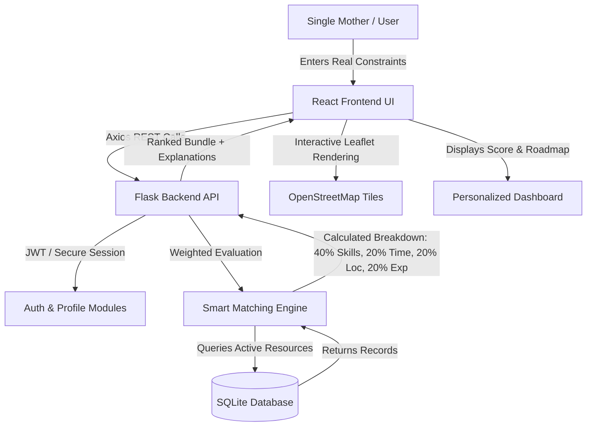

<p align="center">
  
</p>

# SakhiSetu – A Digital Empowerment Platform for Single Mothers

[](https://reactjs.org/)
[](https://tailwindcss.com/)
[](https://flask.palletsprojects.com/)
[](https://www.sqlalchemy.org/)
[](LICENSE)

> **College Innovation Project for Women Empowerment Showcase 2026**  
> *"SakhiSetu does not simply list resources. It understands a mother's circumstances and ranks opportunities according to her real-life constraints."*

---

## 📌 Table of Contents
1. [Problem Statement](#-problem-statement)
2. [Our Solution & Core USP](#-our-solution--core-usp)
3. [Key Features](#-key-features)
4. [Technology Stack](#-technology-stack)
5. [System Architecture](#-system-architecture)
6. [Smart Matching Algorithm (Rule-Based Engine)](#-smart-matching-algorithm-rule-based-engine)
7. [Database Schema & Models](#-database-schema--models)
8. [Project Structure](#-project-structure)
9. [Step-by-Step Installation & Setup](#-step-by-step-installation--setup)
   - [Starting the Backend](#1-starting-the-flask-backend)
   - [Starting the Frontend](#2-starting-the-react-frontend)
10. [REST API Endpoints](#-rest-api-endpoints)
11. [Live Demo Mode & Test Profiles](#-live-demo-mode--test-profiles)
12. [Deployment Guide (Vercel + Render)](#-deployment-guide)
13. [Future Scope](#-future-scope)
14. [Disclaimer](#-disclaimer)

---

## 🔍 Problem Statement
Single mothers face a unique combination of real-life constraints that standard employment portals and search engines completely ignore:
- **Time Inflexibility:** Rigid 9-to-6 schedules conflict directly with school hours, child illness, and evening care.
- **Commute Burdens:** Long transit times are untenable without reliable childcare support.
- **Career Gap Penalties:** Mothers returning to work after childbirth struggle with automated resume parsers.
- **Resource Fragmentation:** Job listings, free upskilling courses, government welfare schemes, and crèche facilities are isolated across dozens of disconnected websites.

---

## 💡 Our Solution & Core USP
**SakhiSetu** bridges these gaps by providing an integrated, circumstance-aware digital platform.

### The Innovation USP
> **"SakhiSetu does not simply list resources. It evaluates a mother's individual circumstances (available daily hours, child's age, commute preference, skills, and experience) and transparently ranks opportunities with clear, explainable compatibility scores."**

No black-box algorithms or fake claims: the matching engine is an honest, mathematically weighted, rule-based expert system designed for maximum trust and transparency.

---

## ✨ Key Features

| Pillar | Features |
|---|---|
| 🔐 **Real Authentication (Mobile / Email / Google)** | Sign up or sign in using Mobile Number, Email, or Google. Real 6-digit OTP confirmation stored and validated against the database. |
| 💼 **Flexible Job Matching** | Part-time, remote, and hybrid roles ranked by feasibility according to real constraints (hours, commute, skills). |
| 🎓 **Skill Gap Bridging** | Directly connects missing job skills with free certifications from NSDC, SWAYAM, and NCS. |
| 🏛️ **Government Welfare Portal** | Indicative eligibility assessment and direct links to Mission Shakti, PMMVY, PMKVY, and STEP. |
| 👶 **Childcare & Crèche Directory** | Clean, searchable directory of verified community crèches with operating hours, contacts, and subsidy inquiry options. |
| 🚀 **5-Step Career Roadmap** | Generates an actionable step-by-step growth path to sustainable financial independence. |


---

## 🛠 Technology Stack

### Frontend
- **Framework:** React.js 18 (Vite build tool)
- **Styling:** Tailwind CSS (Custom warm jewel-tone brand palette)
- **Routing:** React Router DOM v6
- **HTTP Client:** Axios (configured with interceptors & base proxies)
- **Maps:** Leaflet.js & React-Leaflet with OpenStreetMap tiles (No Google Maps API keys required)
- **Icons:** Lucide React

### Backend
- **Language:** Python 3.10+
- **Framework:** Flask 3.0+ & Flask-CORS
- **Database ORM:** SQLAlchemy 2.0+
- **Database Engine:** SQLite (stored at `database/sakhi_setu.db`)
- **Authentication:** Werkzeug security password hashing & PyJWT tokens
- **Matching Engine:** Rule-based 4-factor weighted scoring algorithm

---

## 📐 System Architecture



---

## 🧮 Smart Matching Algorithm (Rule-Based Engine)

The engine calculates an objective compatibility score from **0 to 100%** using the exact formula:

$$\text{Final Score} = (\text{Skill Score} \times 0.40) + (\text{Time Score} \times 0.20) + (\text{Location Score} \times 0.20) + (\text{Experience Score} \times 0.20)$$

### 1. Skill Score ($40\%$ Weight)
- Normalizes candidate skills and job requirements.
- Uses synonym dictionaries (e.g., *MS Office* $\leftrightarrow$ *Excel*, *Typing* $\leftrightarrow$ *Data Entry*, *Telecalling* $\leftrightarrow$ *Customer Support*).
- Calculates overlap ratio: $\frac{\text{Matched Skills}}{\text{Total Required Skills}} \times 100$.
- Returns specific lists of `matched_skills` and `missing_skills`.

### 2. Time Score ($20\%$ Weight)
- Evaluates mother's available hours against the daily requirement:
  - If $\text{Available Hours} \ge \text{Required Hours} \implies 100\%$.
  - If $\text{Ratio} \ge 0.75 \implies 75\%$ (*flexible shift potential*).
  - If $\text{Ratio} \ge 0.50 \implies 50\%$.
  - If large disparity $\implies 25\%$.

### 3. Location Score ($20\%$ Weight)
- **Remote Jobs:** $100\%$ score with zero travel constraint.
- **Same City (Local):** $100\%$ score for on-site/hybrid opportunities in the candidate's home city.
- **Same State:** $60\%$ score.
- **Different State (On-site):** $20\% - 30\%$ score with clear commute warning.

### 4. Experience Score ($20\%$ Weight)
- Fresher-friendly / 0-exp roles award $100\%$ to beginners with zero penalties.
- For experienced candidates, requirements are compared directly with credit for transferable experience.

### Real Benchmark Output (Priya Sharma Demo Profile):
- **Candidate:** Priya Sharma (Pune, 4 hrs/day available, Remote preference, 2 yrs experience, Data Entry)
- **Job:** Data Entry Executive at Sahyog Digital Services (Remote, 4 hrs/day, 1 yr experience, ₹14,000–₹18,000/mo)
- **Calculated Match Score:** **$92.0\%$ (Top Match)**
- **Reasons Generated:**
  - $\checkmark$ *Skills matched: MS Office, Excel, Data Entry, Communication*
  - $\checkmark$ *Your available time (4 hrs/day) fully covers the required 4 hrs/day.*
  - $\checkmark$ *Perfect remote match: Work from home with zero commute constraints.*
  - $\checkmark$ *Your experience (2.0 years) meets the minimum requirement (1.0 years).*

---

## 🗄️ Database Schema & Models

The SQLite database (`database/sakhi_setu.db`) contains 7 relational tables:

1. **`users`**: Real user accounts (`id`, `mobile_number`, `email`, `full_name`, `auth_provider`, `is_verified`, `created_at`).
2. **`otp_records`**: Real OTP verification storage (`id`, `identifier`, `otp`, `purpose`, `expires_at`, `is_used`, `created_at`).
3. **`profiles`**: Full constraint profile (`education_level`, `skills`, `available_hours`, `career_preference`, `child_age`, `city`, `state`, etc.).
4. **`jobs`**: Job postings (`title`, `organization`, `location`, `job_type`, `required_hours`, `minimum_experience`, `salary`, `required_skills`).
5. **`courses`**: Free certifications (`name`, `provider`, `skill_category`, `duration`, `level`, `mode`, `url`).
6. **`schemes`**: Government programs (`name`, `description`, `who_it_helps`, `eligibility`, `required_documents`, `official_url`).
7. **`childcare_centers`**: Local crèches (`name`, `location`, `address`, `contact`, `services`, `opening_hours`).
8. **`recommendations`**: Saved recommendation snapshots for historical review.


---

## 📁 Project Structure

```
sakhisetu/
│
├── backend/
│   ├── app.py                  # Main Flask app, blueprints, CORS, error handling
│   ├── database.py             # SQLite engine & SQLAlchemy setup
│   ├── models.py               # ORM models (User, Profile, Job, Course, etc.)
│   ├── matching_engine.py      # Rule-based 4-factor recommendation engine
│   ├── seed.py                 # Initial database seeder (12 jobs, 9 courses, etc.)
│   ├── tests_matching.py       # Automated 6-profile test suite
│   ├── requirements.txt        # Python backend dependencies
│   ├── .env.example            # Environment variables template
│   └── routes/
│       ├── auth.py             # User registration & JWT login
│       ├── profile.py          # Profile management & demo loader
│       ├── jobs.py             # Job listings & dynamic filters
│       ├── courses.py          # Upskilling course directory
│       ├── schemes.py          # Government welfare directory
│       ├── childcare.py        # Childcare centers with coordinates
│       └── recommendations.py  # Recommendation computation endpoint
│
├── frontend/
│   ├── package.json            # Node.js dependencies
│   ├── vite.config.js          # Vite config with dev proxy to :5000
│   ├── tailwind.config.js      # Tailwind design system configuration
│   ├── postcss.config.js       # PostCSS plugins
│   ├── index.html              # HTML entry with OpenStreetMap & fonts
│   └── src/
│       ├── main.jsx            # React root mount
│       ├── App.jsx             # React Router routing & structure
│       ├── index.css           # Tailwind base styles & custom utilities
│       ├── components/
│       │   ├── Navbar.jsx          # Header with demo triggers & drawer
│       │   ├── Footer.jsx          # Helplines, trust notices & disclaimer
│       │   ├── MatchBadge.jsx      # Dynamic match percentage badge
│       │   ├── JobCard.jsx         # Job card with explainable reasons
│       │   ├── CourseCard.jsx      # Skill bridge course display
│       │   ├── SchemeCard.jsx      # Welfare scheme with document guide
│       │   ├── ChildcareMap.jsx    # Interactive Leaflet OpenStreetMap
│       │   ├── RoadmapTimeline.jsx # 5-step career growth roadmap
│       │   ├── JobDetailModal.jsx  # Detailed breakdown & application modal
│       │   └── LoadingScreen.jsx   # Transparent calculation spinner
│       ├── pages/
│       │   ├── HomePage.jsx            # Landing page with USP & pillars
│       │   ├── RegisterProfilePage.jsx # Comprehensive constraint input form
│       │   ├── DashboardPage.jsx       # Personalized mother dashboard
│       │   ├── JobsPage.jsx            # Searchable jobs catalog
│       │   ├── CoursesPage.jsx         # Free certifications directory
│       │   ├── SchemesPage.jsx         # Government schemes catalog
│       │   └── ChildcarePage.jsx       # Crèche directory & interactive map
│       ├── services/
│       │   └── api.js                  # Axios client & service methods
│       └── data/
│           └── demoProfiles.js         # Benchmark test profiles (Priya, etc.)
│
├── database/
│   └── sakhi_setu.db           # SQLite database file (auto-generated)
│
├── README.md                   # Complete documentation
└── requirements.txt            # Root requirements shortcut
```

---

## 🚀 Step-by-Step Installation & Setup

### Prerequisites
- **Python 3.10+** installed
- **Node.js 18+** & **npm** installed

---

### 1. Starting the Flask Backend

Open **Terminal 1** in the project root:

```bash
# Navigate to the project root
cd sakhisetu

# Create a virtual environment (if not already created)
python -m venv venv

# Activate virtual environment
# Windows (PowerShell):
.\venv\Scripts\Activate.ps1
# Windows (Command Prompt):
.\venv\Scripts\activate.bat
# Linux / macOS:
source venv/bin/activate

# Install dependencies
pip install -r backend/requirements.txt

# Run the database seeder (initializes tables and sample data)
python backend/seed.py

# Run verification tests (optional, verifies all 6 test profiles)
python backend/tests_matching.py

# Start the Flask backend server
python backend/app.py
```

The backend will start at: `http://127.0.0.1:5000`

---

### 2. Starting the React Frontend

Open **Terminal 2** in the project root:

```bash
# Navigate to the frontend directory
cd sakhisetu/frontend

# Install dependencies
npm install

# Start the Vite development server
npm run dev
```

The frontend will start at: `http://localhost:5173`

Open your browser and navigate to **`http://localhost:5173`**.

---

## 📡 REST API Endpoints

| Method | Endpoint | Description |
|---|---|---|
| `GET` | `/api/health` | Health check & service status |
| `POST` | `/api/auth/register` | Register new user account |
| `POST` | `/api/auth/login` | Login and receive JWT access token |
| `POST` | `/api/profile` | Save or update mother's profile |
| `GET` | `/api/profile/<id>` | Fetch profile details by ID |
| `GET` | `/api/profile/demo` | Fetch Priya Sharma demo profile |
| `GET` | `/api/jobs` | Query jobs with filters (`search`, `location`, `job_type`, `hours`, `category`) |
| `GET` | `/api/courses` | Query courses with filters (`category`, `search`) |
| `GET` | `/api/schemes` | Query government welfare schemes with indicative eligibility |
| `GET` | `/api/childcare` | Query childcare & crèche centers with coordinates |
| `POST` | `/api/recommendations` | Execute Smart Matching Engine on a profile payload |

---

## 🧪 Live Demo Mode & Test Profiles

For competition demonstrations, use the built-in presets to show how the matching engine recalculates dynamically:

1. **Priya Sharma (Data Entry & Back Office):**
   - *Circumstances:* 4 hrs/day, Remote, 2 yrs experience, Pune, 6yo child.
   - *Top Match:* **Data Entry Executive (92.0% Match)**.
2. **Anita Verma (Teaching & Tutoring):**
   - *Circumstances:* 2 hrs/day evening, Remote, Math background, 3yo toddler.
   - *Top Match:* **Online Tutor (100% Match)**.
3. **Sunita Kamble (Tailoring & Boutique):**
   - *Circumstances:* 6 hrs/day, On-site, 3 yrs experience, Pune.
   - *Top Match:* **Tailoring Assistant & Supervisor (100% Match)**.
4. **Meera Sen (Junior Web Developer / Tech Returner):**
   - *Circumstances:* 6 hrs/day, Remote, Python & JavaScript skills, Bengaluru.
   - *Top Match:* **Junior Web Developer (100% Match)**.

---

## 🌐 Deployment Guide

### Deploying Frontend on Vercel
1. Push your repository to GitHub.
2. Connect your GitHub repository on [Vercel](https://vercel.com).
3. Set **Root Directory** to `frontend`.
4. In **Environment Variables**, set:
   ```env
   VITE_API_URL=https://your-backend-render-app.onrender.com/api
   ```
5. Deploy! Vercel automatically runs `npm run build` and serves the production build.

### Deploying Backend on Render
1. Create a new **Web Service** on [Render](https://render.com) connected to your GitHub repo.
2. Set **Root Directory** to `backend`.
3. Set **Build Command**: `pip install -r requirements.txt && python seed.py`
4. Set **Start Command**: `gunicorn app:app` (or `python app.py`)
5. In **Environment Variables**, configure:
   ```env
   SECRET_KEY=generate_a_random_secret_string
   PORT=5000
   ```

---

## 🔮 Future Scope
- **Voice-Assisted Form Filling:** Multilingual speech-to-text in Hindi, Marathi, Tamil, and Bengali to assist mothers with limited literacy.
- **Direct Employer Verification:** A dedicated dashboard for inclusive employers offering verified mother-friendly shifts.
- **Community Peer Mentorship:** Secure forums for single mothers to exchange childcare coordination and study groups.

---

## ⚠️ Disclaimer
- **Indicative Welfare Eligibility:** Information regarding government welfare schemes is compiled from public documentation for educational and demonstration purposes. Final eligibility must be verified on official government websites.
- **Sample Demonstration Data:** Childcare center records and job opportunities include realistic sample data created for the college competition prototype.

---

**Made with 🌸 for Single Mothers Everywhere.**
